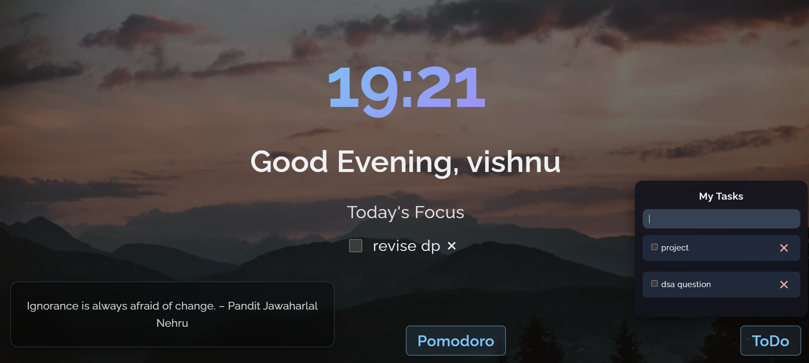
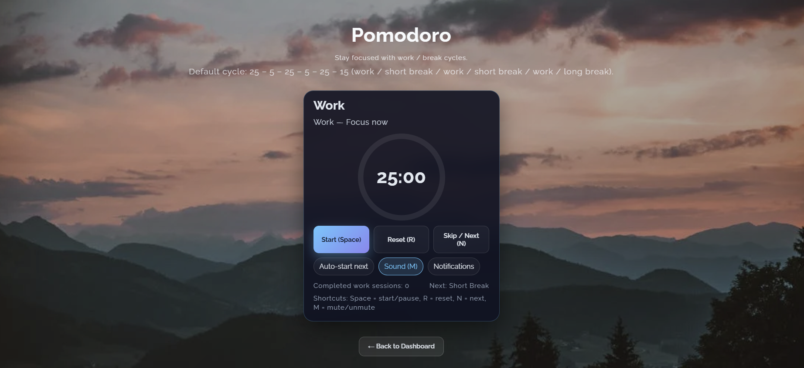

# FocusTab — Pomodoro + Todo + Quotes (Vite + React)

A lightweight productivity dashboard that replaces your new tab:
- Pomodoro timer with 25–5–25–5–25–15 cycles
- Floating Todo list
- Daily quote
- Beautiful randomized backgrounds
- Works as a Microsoft Edge extension (unpacked)

## ✅ Project description
FocusTab helps you focus on deep work with a simple, accessible Pomodoro timer and a minimal todo list. It persists your settings and state, sends notifications at session end, and plays an optional chime. Designed to run as a New Tab extension.

## ✅ Features
- Pomodoro timer: Work/Break cycles (25–5–25–5–25–15 by default, configurable)
- Controls: Start, Pause, Reset, Skip (next session)
- Visual ring progress + large remaining time
- Labels and subtitles for each session
- Auto-start next session (toggle)
- Notification API + optional sound and vibration
- Persistent settings and last state (localStorage)
- Keyboard shortcuts:
  - Space: start/pause
  - R: reset
  - N: next/skip
  - M: mute/unmute
- Todo list with add, complete, delete, clear (persisted)
- Random motivational quote
- Accessible UI (aria-live, focusable controls)

## ✅ Tech stack
- React + Vite
- Vanilla CSS with utility tokens
- Web Notifications API
- LocalStorage for persistence

## ✅ Folder structure
```
browserExtension/
├─ public/
├─ src/
│  ├─ App.jsx
│  ├─ App.css
│  ├─ index.css
│  ├─ main.jsx
│  ├─ assets/
│  ├─ components/
│  │  ├─ PomodoroTimer.jsx
│  │  ├─ PomodoroTimer.css
│  │  ├─ Todo.jsx
│  │  └─ Todo.css
│  ├─ contest/
│  │  └─ browser-context.jsx
│  ├─ db/
│  │  ├─ images.js
│  │  └─ quotes.js
│  ├─ hooks/
│  │  └─ usePomodoro.js
│  ├─ pages/
│  │  ├─ Home/
│  │  │  ├─ Home.jsx
│  │  │  └─ Home.css
│  │  ├─ Pomodoro/
│  │  │  ├─ Pomodoro.jsx
│  │  │  └─ Pomodoro.css
│  │  └─ Task/
│  │     ├─ Task.jsx
│  │     └─ Task.css
│  ├─ reducer/
│  │  └─ browser-reducer.jsx
│  └─ styles/
│     └─ utility.css
├─ .gitignore
├─ package.json
├─ vite.config.js (if present)
├─ manifest.json (add if packaging as an extension)
└─ README.md
```

## 📸 Screenshots
Stored in docs/ so GitHub can render them:

| Dashboard (1) | Dashboard (2) | Pomodoro |
| --- | --- | --- |
|  |  |  |

## 🛠️ Development Setup

1️⃣ Clone the repo
```bash
git clone https://github.com/<your-username>/focustab.git
cd focustab
```

2️⃣ Install dependencies
```bash
npm install
```

3️⃣ Run development server
```bash
npm run dev
```

4️⃣ Build production files (required for extension)
```bash
npm run build
```
The production build is in dist/. This is what the extension uses.

## 🧩 Install as a Microsoft Edge Extension
FocusTab works perfectly as a custom new tab in Edge.

### 🔧 Step-by-step installation
- Step 1 — Build the project: npm run build
- Step 2 — Open: edge://extensions/
- Step 3 — Enable Developer Mode
- Step 4 — Click “Load Unpacked”
- Step 5 — Select your project folder containing:
  - manifest.json
  - dist/
  - public/
- Step 6 — Open a new tab to see FocusTab 🚀

## 🛑 Common Issues
- Module script MIME type errors
  - Use the production build (dist/), not dev files
- Missing vite.svg
  - This file is dev-only; use dist/ build output
- New tab not overriding
  - Ensure manifest has:
    ```json
    {
      "chrome_url_overrides": { "newtab": "dist/index.html" }
    }
    ```
- Sound not playing
  - Start/pause the timer once to satisfy autoplay policies, then enable “Sound”
- Background not covering
  - Ensure body/html/root are 100% height; use background-size: cover

## 🧪 Testing the extension during development
- Make changes, run npm run build
- Go to edge://extensions/, click “Reload” on FocusTab
- Open a new tab to preview changes


---
Made with React + Vite. Enjoy your focus!
